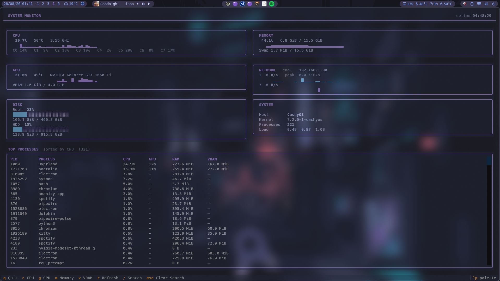
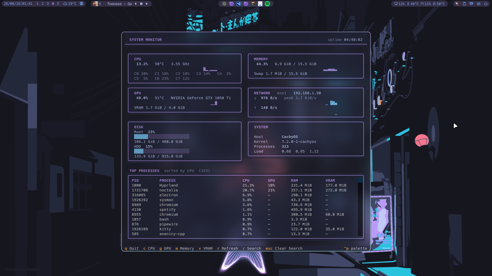

# System Monitor

Terminal-based Linux system monitor built with Textual.

<p align="center">
  
</p>


## Features

- Live CPU monitoring
  - Total CPU usage
  - Per-core utilization
  - CPU temperature
  - Current CPU frequency
  - Short utilization history graph

- NVIDIA GPU monitoring
  - GPU utilization
  - GPU temperature
  - VRAM usage
  - Short utilization history graph

- Memory monitoring
  - RAM usage
  - Swap usage
  - Short utilization history graph

- Disk monitoring
  - Usage for `/`
  - Usage for `/mnt/HDD`
  - Color-coded capacity bars

- Network monitoring
  - Active network interface
  - Local IPv4 address
  - Download and upload speeds
  - Download/upload history graphs
  - RX/TX totals
  - Peak transfer rate

- System information
  - Hostname
  - Kernel version
  - Process count
  - 1, 5 and 15 minute load averages
  - System uptime

- Full process monitor
  - Scrollable process list
  - CPU usage
  - NVIDIA GPU usage
  - RAM usage
  - VRAM usage
  - Sort by CPU, GPU, RAM or VRAM
  - Live process filtering by name or PID

- Lightweight periodic refresh system
  - Fast metrics update every second
  - GPU refresh every 2 seconds
  - Process and disk refresh every 5 seconds
  - Incremental process-table updates instead of rebuilding the entire table

### Controls

| Key | Action |
| --- | --- |
| `q` | Quit |
| `c` | Sort processes by CPU |
| `g` | Sort processes by GPU |
| `m` | Sort processes by RAM |
| `v` | Sort processes by VRAM |
| `/` | Search/filter processes |
| `Esc` | Close or clear search |
| `r` | Manual refresh |
| `Home` | Jump to top of process list |
| `End` | Jump to bottom of process list |
| `Page Up` | Scroll process list up |
| `Page Down` | Scroll process list down |

## Requirements
- Linux
- Python >= 3.13
- NVIDIA drivers / nvidia-smi for GPU metrics
- lm-sensors / psutil sensor support for CPU temperature

## Installation

git clone ...
cd system-monitor
uv tool install .

sysmon

## Controls

q       Quit
c       Sort by CPU
g       Sort by GPU
m       Sort by RAM
v       Sort by VRAM
/       Search processes
Esc     Close/clear search
Home    Top
End     Bottom
PgUp    Page up
PgDn    Page down
r       Refresh

## Optional Hyprland Integration

<p align="center">
  
</p>

`sysmon` works as a normal terminal application, but it can also be launched as a dedicated floating popup under Hyprland.

The example below uses Kitty and launches the monitor with a dedicated `sysmon` window class.

### Launcher

Create the launcher script:

```text
~/.local/bin/toggle-sysmon
```

Add:

```bash
#!/usr/bin/env bash

CLASS="sysmon"

ADDRESS="$(
    hyprctl clients -j |
    jq -r --arg class "$CLASS" '
        first(.[] | select(.class == $class) | .address) // empty
    '
)"

ACTIVE_CLASS="$(
    hyprctl activewindow -j |
    jq -r '.class // ""'
)"

if [[ -n "$ADDRESS" ]]; then
    if [[ "$ACTIVE_CLASS" == "$CLASS" ]]; then
        hyprctl dispatch \
            "hl.dsp.window.close({ window = \"address:$ADDRESS\" })"
    else
        hyprctl dispatch \
            "hl.dsp.focus({ window = \"address:$ADDRESS\" })"
    fi

    exit
fi

kitty \
    --class "$CLASS" \
    --title "System Monitor" \
    --override window_padding_width=0 \
    --override window_margin_width=0 \
    --override window_border_width=0 \
    -e sysmon
```

Make it executable:

```bash
chmod +x ~/.local/bin/toggle-sysmon
```

The launcher behaves as a toggle:

- **Closed** → opens System Monitor
- **Open but unfocused** → focuses System Monitor
- **Focused** → closes System Monitor

### Keybind

For Hyprland Lua configurations, you can bind the launcher to any available shortcut.

Example using `Super + Delete`:

```lua
local mainMod = "Super"

hl.bind(mainMod .. " + Delete", hl.dsp.exec_cmd("~/.local/bin/toggle-sysmon"), {
    description = "System Monitor",
})
```

If `mainMod` is already defined elsewhere in your configuration, reuse the existing variable instead of defining it again.

With the launcher above:

- `Super + Delete` while closed → opens System Monitor
- `Super + Delete` while open but unfocused → focuses it
- `Super + Delete` while focused → closes it
